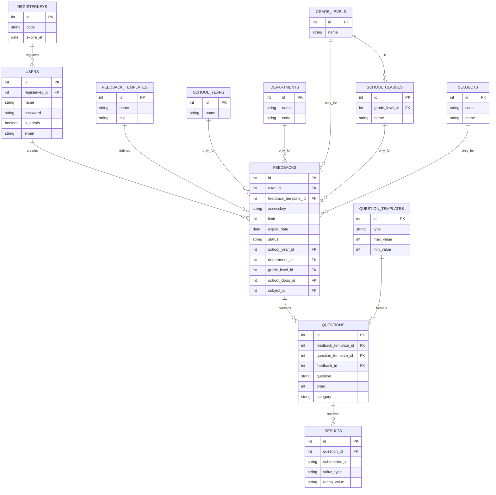

### **Entities and Attributes:**

#### **1. users**
- **Primary Key (PK)**: `id`
- **Foreign Key (FK)**: `registerkey_id` (nullable) - Links to the `registerkeys` table.
- **Attributes**:
  - `name`
  - `password`
  - `is_admin`
  - `email`

This table stores information about users who participate in the feedback system. Some users may be linked to a **registration key**.

---

#### **2. registerkeys**
- **Primary Key (PK)**: `id`
- **Attributes**:
  - `code`
  - `expire_at`

This table holds **registration keys** that might be used for user account creation.

---

#### **3. feedbacks**
- **Primary Key (PK)**: `id`
- **Foreign Keys (FK)**:
  - `user_id` → Links to the `users` table.
  - `feedback_template_id` → Links to the `feedback_templates` table.
  - `school_year_id` → Links to the `school_years` table.
  - `department_id` → Links to the `departments` table.
  - `grade_level_id` → Links to the `grade_levels` table.
  - `school_class_id` → Links to the `school_classes` table.
  - `subject_id` → Links to the `subjects` table.
- **Attributes**:
  - `accesskey`
  - `limit`
  - `already_answered` (nullable) - Now dynamically calculated using distinct submission_ids from the results table
  - `expire_date`
  - `status` - Lifecycle status of the feedback (e.g., 'draft', 'running', 'expired')

This table represents **feedback forms** created by users, linked to specific feedback templates. Each form can be answered multiple times up to the specified limit. The status field controls the form's lifecycle, determining whether it's available for responses.

---

#### **4. feedback_templates**
- **Primary Key (PK)**: `id`
- **Attributes**:
  - `name`
  - `title`

This table stores different **feedback templates** that can be used to create questionnaires.

---

#### **5. questions**
- **Primary Key (PK)**: `id`
- **Foreign Keys (FK)**:
  - `feedback_template_id` → Links to `feedback_templates`
  - `question_template_id` → Links to `question_templates`
  - `feedback_id` → Links to `feedbacks`
- **Attributes**:
  - `question`
  - `order` (nullable) - Controls the sequence of questions within a survey

This table holds **individual questions** for feedback forms, which are linked to a question template.

---

#### **6. question_templates**
- **Primary Key (PK)**: `id`
- **Attributes**:
  - `type`
  - `max_value`
  - `min_value`

This table defines the **types of questions** that can be used in feedback forms, such as multiple-choice, rating scales, etc.

---

#### **7. results**
- **Primary Key (PK)**: `id`
- **Foreign Keys (FK)**:
  - `question_id` → Links to `questions`
- **Attributes**:
  - `submission_id` (UUID) - Groups multiple results belonging to a single survey submission
  - `value_type` - Indicates the data type of the rating_value ('text', 'number', 'checkbox')
  - `rating_value`

This table stores **responses or ratings** provided by users for specific questions. Each submission (a complete set of answers to a feedback form) is grouped by a unique submission_id, which allows for accurate counting of survey responses.

---

#### **8. school_years**
- **Primary Key (PK)**: `id`
- **Attributes**:
    - `name`
    
This table stores **school years**.

---

#### **9. departments**
- **Primary Key (PK)**: `id`
- **Attributes**:
    - `name`
    - `code`

This table stores **departments**.

---

#### **10. grade_levels**
- **Primary Key (PK)**: `id`
- **Attributes**:
    - `name`

This table stores **departments**.

---

#### **11. school_classes**
- **Primary Key (PK)**: `id`
- **Foreign Keys (FK)**:
    - `grade_level_id` → Links to `grade_levels`
- **Attributes**:
    - `name`

This table stores **school classes**.

---

#### **11. subjects**
- **Primary Key (PK)**: `id`
- **Attributes**:
    - `name`
    - `code`

This table stores **subjects**.

---

### **Relationships:**
1. **users → feedbacks** (1:N)
   - A user can create **multiple feedback forms**, but each form belongs to one user.

2. **registerkeys → users** (1:N)
   - A **registration key** can be associated with multiple users.

3. **feedback_templates → feedbacks** (1:N)
   - A feedback form is based on one **template**, but multiple feedback instances can be linked to a template.

4. **feedbacks → questions** (1:N)
   - Each **feedback form** consists of multiple **questions**.

5. **question_templates → questions** (1:N)
   - A **question template** can be used for multiple **questions**.

6. **questions → results** (1:N)
   - Each **question** has multiple **responses** in the results table.

7. **results (grouped by submission_id)** (logical grouping)
   - Results with the same submission_id form a logical group representing a single submission response to a feedback form.
   - This enables tracking the number of submissions for each feedback form by counting distinct submission_ids.

8. **school_years → feedbacks** (1:N)
    - A **school year** can be associated with multiple feedbacks.

9. **departments → feedbacks** (1:N)
    - A **department** can be associated with multiple feedbacks.

10. **grade_levels → feedbacks** (1:N)
     - A **grade_level** can be associated with multiple feedbacks.

11. **school_classes → feedbacks** (1:N)
     - A **school classes** can be associated with multiple feedbacks.

12. **subjects → feedbacks** (1:N)
    - A **subject** can be associated with multiple feedbacks.

13. **grade_levels → school_classes** (1:N)
    - A **grade_level** can be associated with multiple school_classes.
---

*Note: Laravel's internal tables (sessions, cache, jobs, etc.) are intentionally omitted from this document as they are not part of the core application domain model.*
